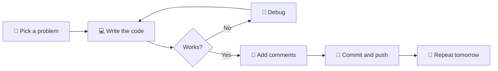
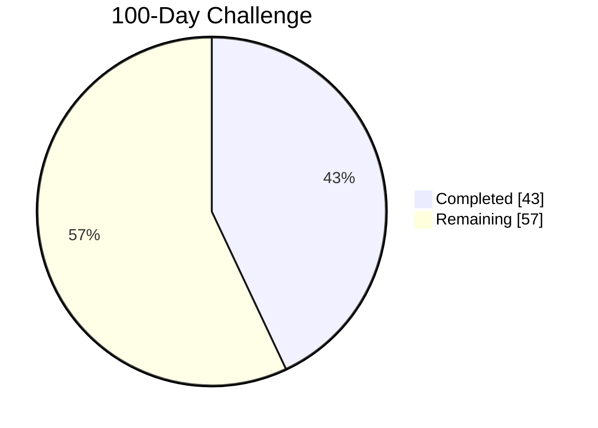
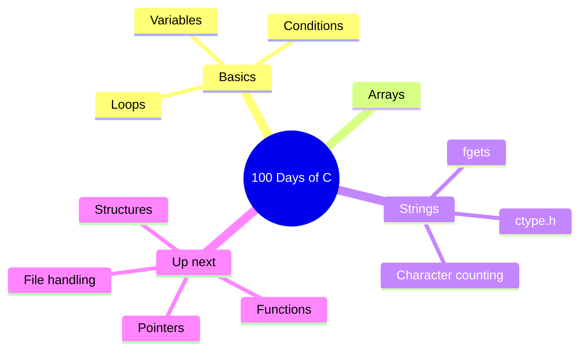

<a name="readme-top"></a>

<div align="center">


<a href="https://git.io/typing-svg">
  
</a>

<br/>


<br/>

<!-- Action buttons -->
<a href="https://github.com/paarthmishra-git/PAARTHMISHRA-UPES-100DAYSCODING/stargazers"></a>
&nbsp;
<a href="https://github.com/paarthmishra-git/PAARTHMISHRA-UPES-100DAYSCODING/fork"></a>
&nbsp;
<a href="https://github.com/paarthmishra-git"></a>

<br/><br/>

**[🎯 About](#-about) · [📈 Progress](#-progress-tracker) · [🧩 Puzzles](#-guess-the-output) · [📅 Day Log](#-day-log) · [🗺 Roadmap](#-roadmap) · [📊 Stats](#-github-stats) · [❓ FAQ](#-faq) · [🤝 Connect](#-connect)**

</div>

---

## 🎯 About

A **100-day coding challenge** from my B.Tech in Computer Science and Engineering at **UPES Dehradun**. The goal is simple: build a daily coding habit, sharpen problem-solving, and document everything publicly.

<table>
<tr>
<td width="33%" valign="top">

### 🔥 Objectives
- Code **100 days** in a row
- Master programming fundamentals
- Build and document in public

</td>
<td width="33%" valign="top">

### 📏 Rules
- Minimum **1 hour** per day
- One commit for every day
- No skipped days

</td>
<td width="33%" valign="top">

### 🧠 Focus Areas
- Problem solving
- Strings and arrays
- Clean, commented code

</td>
</tr>
</table>

<div align="center">


</div>

<details>
<summary><b>🔁 My daily loop (click to open)</b></summary>



</details>

<div align="right"><a href="#readme-top">⬆ back to top</a></div>

---

## 📈 Progress Tracker

```text
Day 43 of 100
▰▰▰▰▰▰▰▰▰▰▰▰▰▰▰▰▰▰▰▰▰▰▰▰▰▰▰▰▰▰▰▰▰▰▰▰▰▰▰▱▱▱▱▱▱▱▱▱▱▱▱▱▱▱▱▱▱▱▱▱▱▱▱▱▱▱▱▱▱▱  43%
```



### 🗓 100-Day Grid

✅ = done · ⬜ = coming soon

| | 1 | 2 | 3 | 4 | 5 | 6 | 7 | 8 | 9 | 10 |
|:--|:-:|:-:|:-:|:-:|:-:|:-:|:-:|:-:|:-:|:-:|
| **1–10**   | ✅ | ✅ | ✅ | ✅ | ✅ | ✅ | ✅ | ✅ | ✅ | ✅ |
| **11–20**  | ✅ | ✅ | ✅ | ✅ | ✅ | ✅ | ✅ | ✅ | ✅ | ✅ |
| **21–30**  | ✅ | ✅ | ✅ | ✅ | ✅ | ✅ | ✅ | ✅ | ✅ | ✅ |
| **31–40**  | ✅ | ✅ | ✅ | ✅ | ✅ | ✅ | ✅ | ✅ | ✅ | ✅ |
| **41–50**  | ✅ | ✅ | ✅ | ⬜ | ⬜ | ⬜ | ⬜ | ⬜ | ⬜ | ⬜ |
| **51–60**  | ⬜ | ⬜ | ⬜ | ⬜ | ⬜ | ⬜ | ⬜ | ⬜ | ⬜ | ⬜ |
| **61–70**  | ⬜ | ⬜ | ⬜ | ⬜ | ⬜ | ⬜ | ⬜ | ⬜ | ⬜ | ⬜ |
| **71–80**  | ⬜ | ⬜ | ⬜ | ⬜ | ⬜ | ⬜ | ⬜ | ⬜ | ⬜ | ⬜ |
| **81–90**  | ⬜ | ⬜ | ⬜ | ⬜ | ⬜ | ⬜ | ⬜ | ⬜ | ⬜ | ⬜ |
| **91–100** | ⬜ | ⬜ | ⬜ | ⬜ | ⬜ | ⬜ | ⬜ | ⬜ | ⬜ | ⬜ |

### 🏁 Milestones

- [x] 🌱 **Day 1**: Started the challenge
- [x] 🔟 **Day 10**: First 10 days done
- [x] 2️⃣5️⃣ **Day 25**: Quarter of the way
- [ ] 5️⃣0️⃣ **Day 50**: Halfway point
- [ ] 7️⃣5️⃣ **Day 75**: Final stretch
- [ ] 💯 **Day 100**: Challenge complete

<div align="right"><a href="#readme-top">⬆ back to top</a></div>

---

## 🧩 Guess the Output

Try to work it out in your head first, then click to reveal the answer.

<details>
<summary><b>Puzzle 1 · Easy 🟢</b></summary>

```c
char s[] = "hello";
s[0] = 'J';
printf("%s\n", s);
```

<details>
<summary>👀 Reveal answer</summary>

**`Jello`**. Because `s` is a `char` array (a modifiable copy), you can change its characters. With `char *s = "hello";` the same edit would be undefined behaviour.

</details>
</details>

<details>
<summary><b>Puzzle 2 · Medium 🟡</b></summary>

```c
printf("%zu\n", sizeof("abc"));
```

<details>
<summary>👀 Reveal answer</summary>

**`4`**. A string literal includes the hidden `'\0'` terminator, so `"abc"` takes 4 bytes.

</details>
</details>

<details>
<summary><b>Puzzle 3 · Medium 🟡</b></summary>

```c
int a[] = {10, 20, 30};
printf("%d\n", *(a + 1));
```

<details>
<summary>👀 Reveal answer</summary>

**`20`**. `a + 1` points at the second element, and `*` reads its value. In other words, `*(a + 1)` is the same as `a[1]`.

</details>
</details>

<div align="right"><a href="#readme-top">⬆ back to top</a></div>

---

## 📅 Day Log

> Click a block to expand it. 👇

<details open>
<summary><b>🟢 Days 41 – 43 · Strings (latest)</b></summary>
<br/>

| Day | Program | Concept |
|:---:|:--------|:--------|
| 43 | [`day43q1.c`](./day43q1.c) | Count spaces, digits and special characters in a string |
| 43 | [`day43q2.c`](./day43q2.c) | String practice |
| 42 | [`day42q1.c`](./day42q1.c) · [`day42q2.c`](./day42q2.c) | String practice |
| 41 | [`day41a.c`](./day41a.c) · [`day41b.c`](./day41b.c) · [`day41c.c`](./day41c.c) | String practice |
| 41 | [`day41q1.c`](./day41q1.c) · [`day41q2.c`](./day41q2.c) | String practice |

</details>

<details>
<summary><b>🔵 Days 31 – 40</b></summary>
<br/>

| Day | Program | Concept |
|:---:|:--------|:--------|
| 40 | [`day40q2.c`](./day40q2.c) | _add topic_ |
| … | … | … |

</details>

<details>
<summary><b>🟣 Days 1 – 30</b></summary>
<br/>

| Day | Program | Concept |
|:---:|:--------|:--------|
| 7 | [`day7q1.c`](./day7q1.c) · [`day7q2.c`](./day7q2.c) | _add topic_ |
| 6 | [`day6q1.c`](./day6q1.c) · [`day6q2.c`](./day6q2.c) | _add topic_ |
| 5 | [`day5q1.c`](./day5q1.c) · [`day5q2.c`](./day5q2.c) | _add topic_ |
| 4 | [`day4q1.c`](./day4q1.c) · [`day4q2.c`](./day4q2.c) | _add topic_ |
| … | … | … |

</details>

<details>
<summary><b>💡 Featured snippet: Day 43 (character counter)</b></summary>

```c
//Count the number of spaces, digits, and special characters in a string.
#include <stdio.h>
#include <ctype.h>

int main() {
    char str[100];
    int spaces = 0, digits = 0, special = 0;

    printf("Enter a string: ");
    fgets(str, sizeof(str), stdin);

    for (int i = 0; str[i] != '\0'; i++) {
        if (str[i] == '\n' || str[i] == '\r') {
            continue;  // ignore newline from fgets
        }

        if (str[i] == ' ') {
            spaces++;
        } else if (isdigit((unsigned char)str[i])) {
            digits++;
        } else if (!isalpha((unsigned char)str[i])) {
            special++;
        }
    }

    printf("Spaces: %d\n", spaces);
    printf("Digits: %d\n", digits);
    printf("Special characters: %d\n", special);
    return 0;
}
```

</details>

<div align="right"><a href="#readme-top">⬆ back to top</a></div>

---

## 🗺 Roadmap

<details open>
<summary><b>Skill map (what I've covered and what's next)</b></summary>



</details>

<div align="right"><a href="#readme-top">⬆ back to top</a></div>

---

## 🛠 Tech Stack

<div align="center">


</div>

---

## 📊 GitHub Stats

<div align="center">


<br/>


<br/>


<br/>


<br/><br/>

<!-- Needs the snake workflow (.github/workflows/snake.yml). Run it once to generate the image. -->
<picture>
  <source media="(prefers-color-scheme: dark)" srcset="https://raw.githubusercontent.com/paarthmishra-git/PAARTHMISHRA-UPES-100DAYSCODING/output/github-snake-dark.svg" />
  
</picture>

</div>

<div align="right"><a href="#readme-top">⬆ back to top</a></div>

---

## ▶️ Run Any Program

<details>
<summary><b>Compile and run steps</b></summary>

```bash
# 1. Clone the repo
git clone https://github.com/paarthmishra-git/PAARTHMISHRA-UPES-100DAYSCODING.git
cd PAARTHMISHRA-UPES-100DAYSCODING

# 2. Compile any file
gcc day43q1.c -o day43q1

# 3. Run it
./day43q1          # Linux / macOS
day43q1.exe        # Windows
```

</details>

<details>
<summary><b>No compiler? Try it online</b></summary>

Copy any `.c` file into [OnlineGDB](https://www.onlinegdb.com/online_c_compiler) or [Compiler Explorer](https://godbolt.org/) and run it in your browser.

</details>

---

## ❓ FAQ

<details>
<summary><b>What does <code>day43q1.c</code> mean?</b></summary>

`day<N>q<M>.c` means Day **N**, Question **M**. So `day43q1.c` is Day 43, Question 1.

</details>

<details>
<summary><b>Can I use this code?</b></summary>

Yes. Feel free to read, run, and learn from it. If it helps, a ⭐ is appreciated.

</details>

<details>
<summary><b>Want to join the challenge?</b></summary>

Fork this repo, rename it with your name, and start your own 100 days. Open an issue and tell me when you begin.

</details>

<details>
<summary><b>Found a bug or a better solution?</b></summary>

[Open an issue](https://github.com/paarthmishra-git/PAARTHMISHRA-UPES-100DAYSCODING/issues/new) or send a pull request.

</details>

---

## 🤝 Connect

<div align="center">

[](https://github.com/paarthmishra-git)
[](https://www.linkedin.com/in/your-profile)

<br/>

### ⭐ Star history

<a href="https://star-history.com/#paarthmishra-git/PAARTHMISHRA-UPES-100DAYSCODING&Date">
  
</a>

<br/>

**If this repo motivates you, drop a star and start your own 100-day streak!**

<a href="#readme-top">⬆ back to top</a>


</div>
